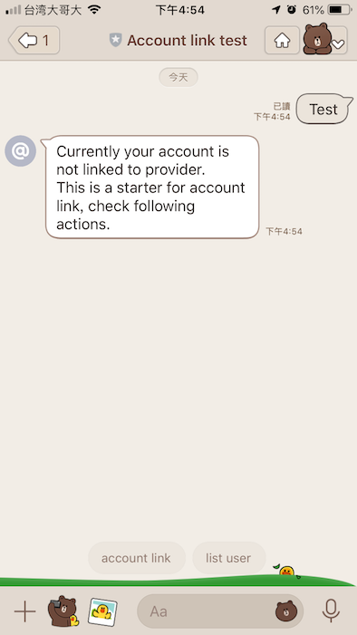
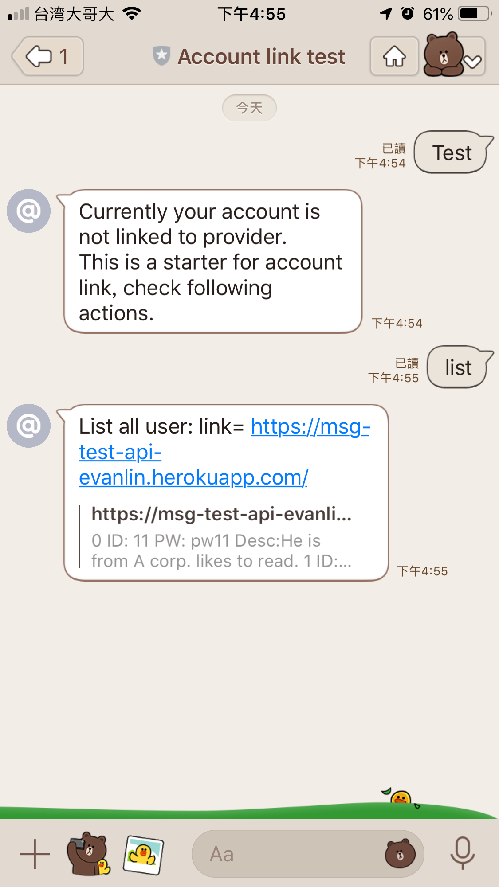
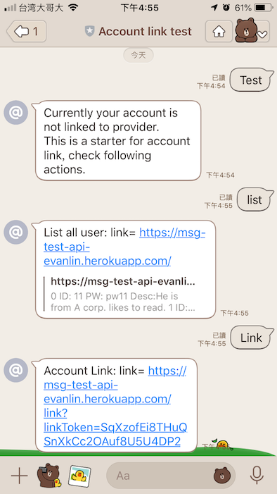
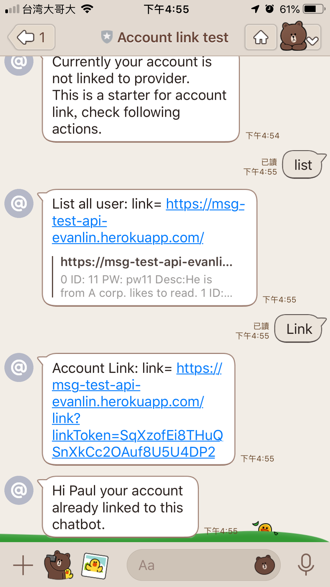
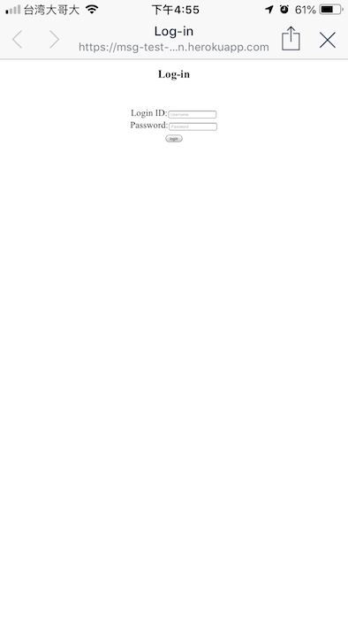
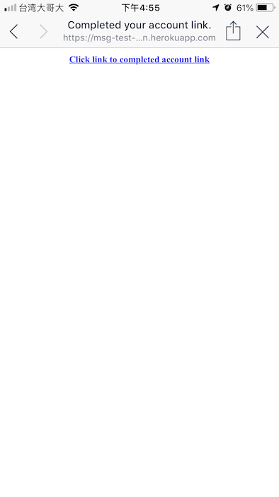
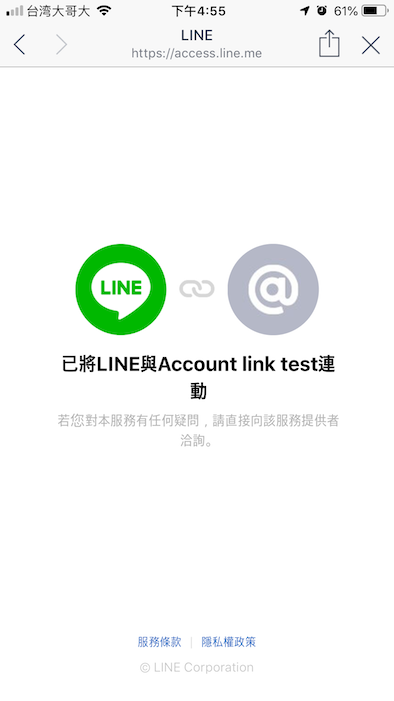
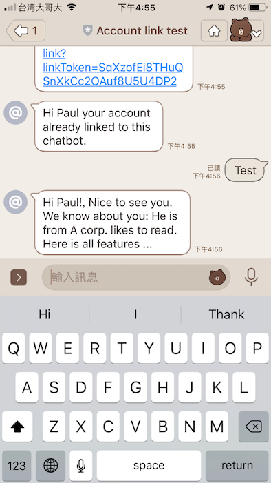

LINE account link: Sample code for LINE account link
==============

 

This is sample code to demostration LINE chatbot account link, refer to document https://developers.line.biz/en/docs/messaging-api/linking-accounts/

You could see each step mark in comment (from step 1 to 12)

1. The bot server calls the API that issues a link token from - the LINE user ID.
2. The LINE Platform returns the link token to the bot server.
3. The bot server calls the Messaging API to send a linking URL to the user.
4. The LINE Platform sends a linking URL to the user.
5. The user accesses the linking URL.
6. The web server displays the login screen.
7. The user enters his/her credentials.
8. The web server acquires the user ID from the provider's service and uses that to generate a nonce.
9. The web server redirects the user to the account-linking endpoint.
10. The user accesses the account-linking endpoint.
11. The LINE Platform sends an event (which includes the LINE user ID and nonce) via webhook to the bot server.
12. The bot server uses the nonce to acquire the user ID of the provider's service.

Installation
=============

- Create your LINE Developer account and create a developer trial account.  
  

- Deploy this project to heroku
    - You need to fill following configuration during you create project.
        - LINECORP_PLATFORM_CHANNEL_CHANNELSECRET
        - LINECORP_PLATFORM_CHANNEL_CHANNELTOKEN
        - LINECORP_PLATFORM_CHANNEL_SERVERURL
- Update the webhook url with https://xxx.herokuapp.com/callback in LINE developer
- Done

If you don't want to deploy your own LINE account link chatbot, you can click follow to add friend

How to Use it
=============

- Input any test will show quick reply "account link" and  "list user"

- Input "list user"

- Click link of "list user" will display all user from provider website.

# Test account link

- Input "link"

  

- Input ID, PW. (refer from "list") (e.g.  "11", "pw11")

  

- Click "Click link to completed account link" to link your account to chatbot.

  

- Close browser

  

- Chatbot already link to your account, input any text will show your information.

  

